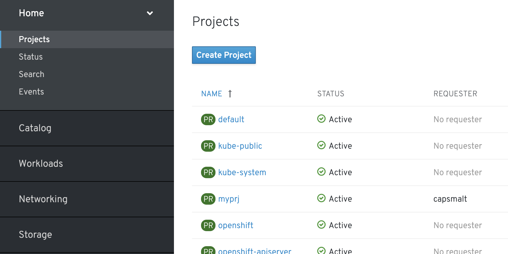
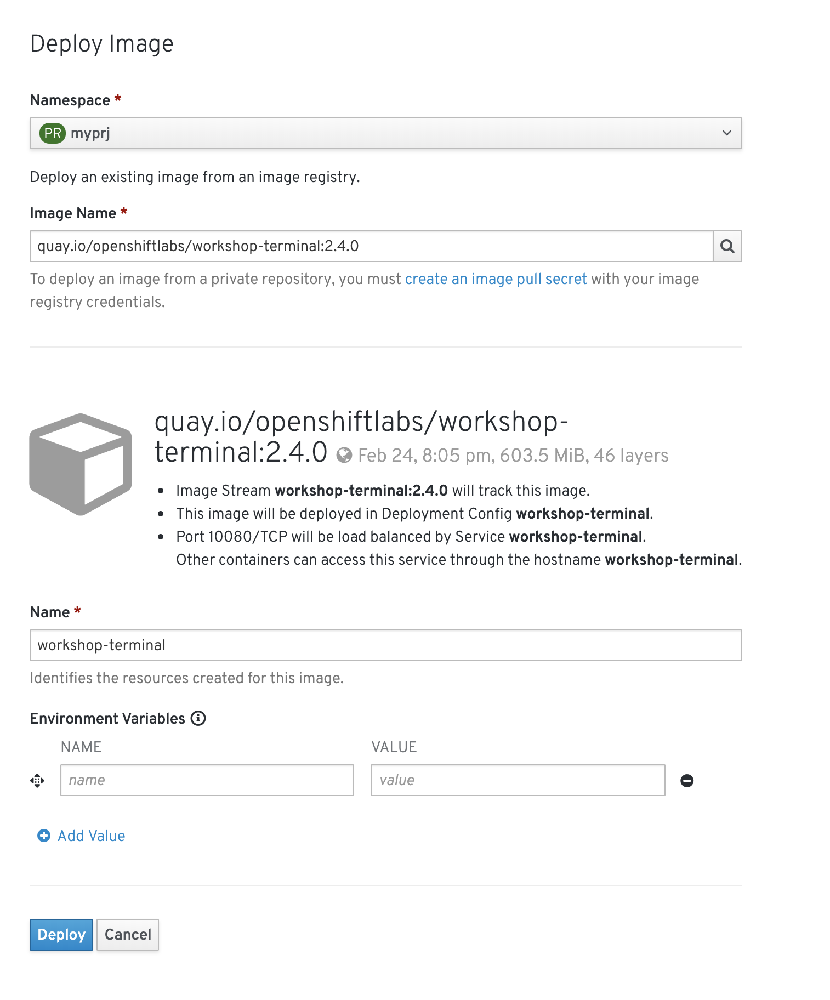
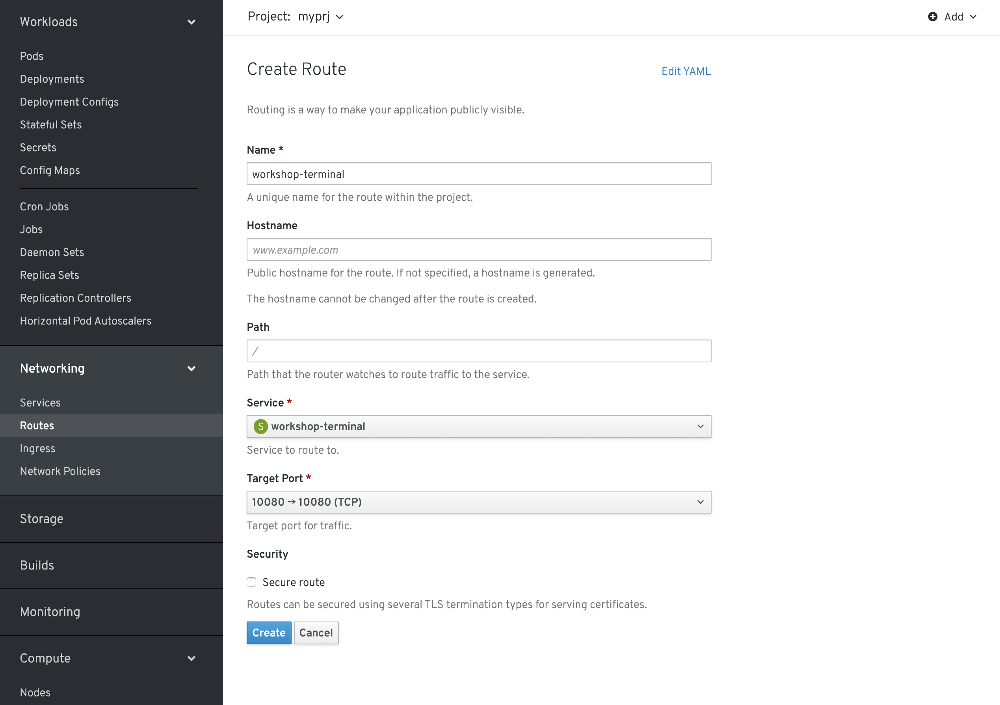
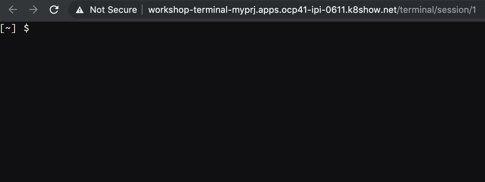

# 既存コンテナイメージを使ってOCPにデプロイ
1. 任意のプロジェクトを選択
    
    Home > Project > myprj(任意)
    
    

1. **Add > Deploy Image** のように選択します

    

1. **Namespace**(プロジェクト名)，と**Image Name** を指定します
    - Namespace: `作成済プロジェクト(例: myprj)`
    - Image Name: `quay.io/openshiftlabs/workshop-terminal:2.4.0`

    

1. **検索ボタン** をクリックし，Name(workshop-terminal)を確認して，**Deploy** を選択します

    

1. 外部からアクセスするための **Route** を作成します

    Networking > Routes > Create Route を選択し，以下を指定した後 **Create** を選択します
    - Name: `任意のRoute名前(例: workshop-terminal)`
    - Service: `対象アプリ用のService(例: workshop-terminal)`
    - Target Port: `10080 → 10080(TCP)`

    

1. Location欄にあるリンクを開きます
    例: `http://workshop-terminal-myprj.apps.ocp41-ipi-0611.k8show.net`

    

1. Terminalアプリが表示されることを確認します

    

以上で，OCP上にアプリケーションをデプロイする手順は完了です。

>ハンズオン要約
>
>2つのアプリケーションデプロイの方法を実施しました。
>- カタログ上で指定したソースコードからコンテナイメージをビルドして，そのイメージを使ってアプリケーションをデプロイする方法
>- 既存のコンテナイメージをOCP上にアップロードして，コンテナイメージを使ってアプリケーションをデプロイする方法
>- XXXXXX (Import yamlはやる？)

# CI/CDによる自動デプロイ
**UNDER CONSTRUCTION**

```
oc get templates -n openshift
oc get templates -n openshift | grep jenkins
oc get pods | grep jenkins
oc new-app jenkins-ephemeral
oc get pods
oc project
oc delete jenkins-1-deploy
oc new-project mycicd
oc project
oc get templates -n openshift
oc get templates -n openshift | grep jenkins
oc new-app jenkins-ephemeral -n mycicd
oc get routes
oc get template/jenkins-ephemeral -o json -n openshift
oc create -f https://raw.githubusercontent.com/openshift/origin/master/examples/jenkins/pipeline/nodejs-sample-pipeline.yaml
oc get buildconfigs
oc get buildconfig/nodejs-sample-pipeline -o yaml
oc get route
oc start-build nodejs-sample-pipeline
```

