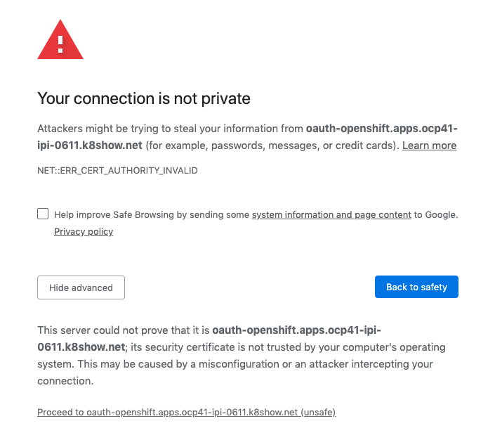
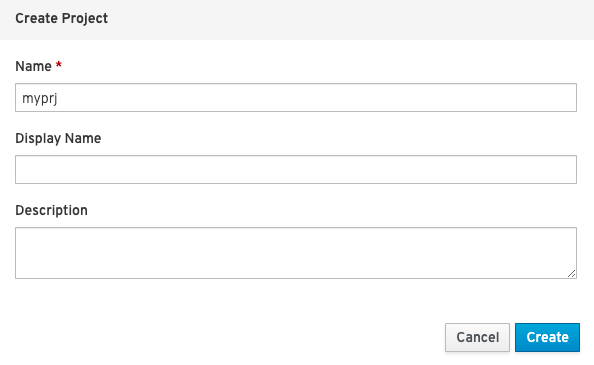
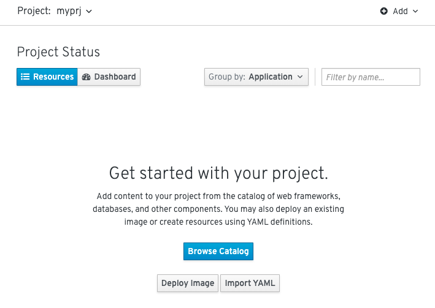
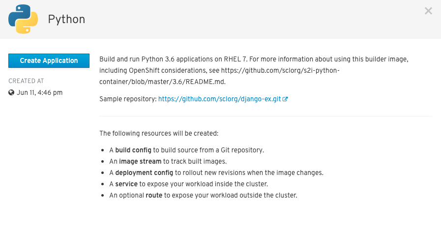
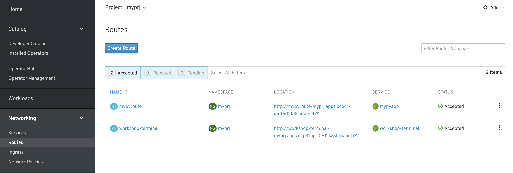

# タイムテーブル
|Time|Agenda|Content|
|:---:|:---|:---|
|13:00-13:30|受付||
|13:30-14:00|Red Hat OpenShift 4 概要|<講義>|
|14:00-15:00|Red Hat OpenShift 4 基礎ワークショップ|<ハンズオン> <br> OpenShift 4 環境デプロイメント|
|15:00-15:15|Break|
|15:15-16:30|Red Hat OpenShift 4 基礎ワークショップ|<講義+ハンズオン> <br> OpenShift 4 を活用したビルド/デプロイメントパイプライン|
|16:30-17:00|まとめ+QA||

# 諸連絡
OCP環境情報など(Etherpad) ==> https://bit.ly/31V0DAf

# ハンズオン環境および前提
本ハンズオンは，Kubernetesクラスターの動作環境としてAWSを使用します。K8s(OCP)クラスターは構築済です。
受講者は，K8s(OCP)クラスターに対するCUI操作をを行う際は，クライアントPCからSSHなどでEC2インスタンスに接続し，EC2からCLIを使用して，K8s(OCP)クラスターに対する操作を行います。GUIによる操作は，クライアントPCのブラウザを使用します。
このため以下の準備を事前に済ませておいてください。
- SSH用ツール
- ブラウザ(Google Chrome or Firefox)

# ハンズオン概要
本ハンズオンは，OpenShift4(以降，OCPまたはOCP4)の基礎編です。

以下を学びます。
- Kubernetesクラスター(OCP4)の構築
- アプリケーションのデプロイ
  - ソースコードからコンテナイメージをビルドしてデプロイ
  - 既存のコンテナイメージをOCP上に展開してデプロイ
- CI/CDによる自動デプロイ

なお，インフラエンジニア向け，アプリ開発エンジニア向けを想定した発展的なコンテンツについては，今後のワークショップで実施予定です。

# AWS環境の準備
1. AWSアカウントの作成
1. IAMユーザー作成(AdministratorAccessポリシーをセット)
1. sshキーペアを作成し，AWS上に登録します
    ```
    ssh-keygen -t rsa -b 4096 -f ~/.ssh/id_rsa_ocp
    ```
1. アクセスキー取得
1. シークレットアクセスキー取得
1. AWS CLI取得
    - https://docs.aws.amazon.com/ja_jp/cli/latest/userguide/install-bundle.html
1. AWSアクセスキーやシークレットアクセスキー，デフォルトリージョンなどをセットアップ
1. AWSリソース制限緩和
    - EIP
    - EC2
    - VPC

# 0) OCP4クラスターの構築
## 0-1) 事前準備
IPIを使用してK8s(OCP)クラスターを構築します。
1. Red Hat Customer Portalにログインします

    ==> https://try.openshift.com/
    
    (※アカウント未所持の場合は新規に作成します)

1. **Get started** を選択し，以下のように指定して進めます
    - (基本的には https://cloud.redhat.com/openshift/install/aws/installer-provisioned に従って進めます)
    - Infrastructure Provider: `AWS`
    - Install on AWS: Infrastructure Type: `Installer-Provisioned Infrastructure`
1. OCPインストーラを取得します
    - ファイルサーバー(https://mirror.openshift.com/pub/openshift-v4/clients/ocp/latest/) から以下の2つを取得します
        - OpenShiftインストールするためのCLI(Mac/Linux用があります)
        - OpenShiftを制御するためのCLI(Mac/Linux/Windows用があります)
1. 前の手順で取得した2つのCLIバイナリを`/usr/local/bin`に移動します
    - openshift-install
    - oc
          
    >Tips:
    >
    >homebrewで`brew install openshift-cli`のようにして導入することもできます

## 0-2) OCP4クラスターのインストール
1. OCPインストール用の **Pull Secret** をコピーします

    自身のRed Hat Customer Portalのページから取得してください
    
    ==> https://cloud.redhat.com/openshift/install/aws/installer-provisioned

1. インストール用の設定ファイルを作成します

    ```
    $ openshift-install create install-config
    ```
    
    上記実行後に，OCPインストール先となるAWS環境情報をインタラクティブに入力(選択)します。
    - provider: aws
    - region: <任意>
    - domain: <Route53で事前取得したドメイン>
    - cluster name: 任意
    - aws access key: XXXXX
    - aws secret key: XXXXX
    - pull secret: <try.openshift.comから取得>

1. インストール用の設定ファイルをコピーして保管しておきます

    ```
    $ mkdir backupConfigDir; cp -p install-config.yaml
    ```
    
1. OCPをインストールします

    ```
    $ openshift-install create cluster
    ```
    
    >Tips:
    >
    >OCP4クラスターが完成するまでに40分ほどかかります。  
    >内部的にはTerraformを使用して，AWSのCloud Provider APIを叩くことでAWSリソースを準備しています。主なリソースは以下です。
    >- EC2: 7台
    >    - Master: 3台
    >    - Worker: 3台
    >    - etcd: 1台 
    >- Elastic IP:

# 1) OCP4 コンソールツアー
IPIで構成されたAWSリソースや，OCP4コンソールを確認します

# 2) アプリケーションのデプロイ
OCPはカタログ機能を備えています。JavaやPythonなどの各種ランタイムやデータベースなどのミドルウェアを簡単にK8s上で使うことができます。実際にカタログ上からK8s上にデプロイしてみましょう。

## 2-1) プロジェクトの作成
1. ブラウザを立ち上げて **OCPコンソール** に接続します

    - Console URL: `https://oauth-openshift.apps.ocp41-ipi-0611.k8show.net`
    - Username: `capsmalt`
    - Password: `xxxxxxxx`
    
    > 自身のOCPクラスターのログイン情報を使用してください。
    > 

   

    >Tips:
    >
    >もし以下図のようなエラーが出て場合は例外追加を行ってください。
    >
    >
    >
    >


1. Home > Projects > Create Project を選択します

    

1. 任意のプロジェクト名を指定し，**Create** を選択します

    

    >Tips:
    >
    >OCPではプロジェクトを作成することで，新規Namespace(=プロジェクト名)が生成されます。NamespaceはK8sクラスターを論理的に分離させることが可能なK8sリソースの一種です。例えば，アプリA用のNamespaceを`ns_appa`，アプリB用のNamespaceを`ns_appb`のように作成することで，同一のK8sクラスター内に存在するns_appaとns_appbが干渉しないように構成することも可能です。

    

## 2-2) カタログ(ソース)からアプリケーションをデプロイ
1. Catalog > Developer Catalog > Python を選択します

    

    >Tips:
    >
    >Developer CatalogからPythonアプリケーションを作成することで以下のリソースが作成されます。
    >- Build config
    >    - Gitリポジトリからソースコードをビルド
    >- Image stream
    >    - ビルド済イメージのトラッキング
    >- Deployment config    
    >    - イメージ変更の際に新リビジョンにロールアウト
    >- Service
    >    - クラスター内にワークロードを公開
    >- Route
    >    - クラスター外にワークロードを公開

1. **Create Application** を選択して，任意の**アプリケーション名** と **Gitリポジトリ** を指定します

    - Name:`任意の名前(例: mypyapp)`
    - Git Repoaitory: `https://github.com/sclorg/django-ex.git` 
      - ("Try Sample↑" をクリックするとURLがセットされます)

    


    
    
1. 最後に **Create** を選択します

    >Tips:
    >
    >指定した名前のアプリケーション(コンテナ)が動作するPodがデプロイされました。
    >OCPコンソールで，Workloads > Pods > アプリ名-x-xxxx のように辿ることで確認できます。


    下図のように，デプロイ直後は **"0 of 1 pods"** のように動作準備中の状態です。
    
    

    少し待つと，下図のように **"1 of 1 pods"** のように正常に動作した状態を確認できます。
    
    
    
    
## 2-3) 外部からアクセスするためのRoute(ルート)を作成
1. Networking > Routes > Create Route を選択します


1. 任意の**Route名**，対象アプリ用の**Service**，**Port** を指定します
    - Name: `任意の名前(例: mypyroute)`
    - Service: `mypyapp`
    - Target Port: `8080 → 8080(TCP)`
1. 最後に **Create** を選択します

    >Tips:
    >
    >Networking > Routes > ルート名 のように辿ることで確認できます。

## 2-4) アプリケーションの動作確認
1. Networking > Routes > ルート名 を選択し，Location欄にあるリンクを開きます
    例: `http://mypyroute-myprj.apps.ocp41-ipi-0611.k8show.net`

    

1. Pythonアプリのサンプルページが表示されることを確認します

    

## Option-1) 既存コンテナイメージを使ってOCPにアプリデプロイ
1. 任意のプロジェクトを選択
    
    Home > Project > myprj(任意)
    
    

1. **Add > Deploy Image** のように選択します

    

1. **Namespace**(プロジェクト名)，と**Image Name** を指定します
    - Namespace: `作成済プロジェクト(例: myprj)`
    - Image Name: `quay.io/openshiftlabs/workshop-terminal:2.4.0`

    

1. **検索ボタン** をクリックし，Name(workshop-terminal)を確認して，**Deploy** を選択します

    

1. 外部からアクセスするための **Route** を作成します

    Networking > Routes > Create Route を選択し，以下を指定した後 **Create** を選択します
    - Name: `任意のRoute名前(例: workshop-terminal)`
    - Service: `対象アプリ用のService(例: workshop-terminal)`
    - Target Port: `10080 → 10080(TCP)`

    

1. Location欄にあるリンクを開きます
    例: `http://workshop-terminal-myprj.apps.ocp41-ipi-0611.k8show.net`

    

1. Terminalアプリが表示されることを確認します

    

以上で，OCP上にアプリケーションをデプロイする手順は完了です。

>ハンズオン要約
>
>2つのアプリケーションデプロイの方法を実施しました。
>- カタログ上で指定したソースコードからコンテナイメージをビルドして，そのイメージを使ってアプリケーションをデプロイする方法
>- 既存のコンテナイメージをOCP上にアップロードして，コンテナイメージを使ってアプリケーションをデプロイする方法
>- XXXXXX (Import yamlはやる？)

# 3) CI/CDによる自動デプロイ
**UNDER CONSTRUCTION**

```
oc get templates -n openshift
oc get templates -n openshift | grep jenkins
oc get pods | grep jenkins
oc new-app jenkins-ephemeral
oc get pods
oc project
oc delete jenkins-1-deploy
oc new-project mycicd
oc project
oc get templates -n openshift
oc get templates -n openshift | grep jenkins
oc new-app jenkins-ephemeral -n mycicd
oc get routes
oc get template/jenkins-ephemeral -o json -n openshift
oc create -f https://raw.githubusercontent.com/openshift/origin/master/examples/jenkins/pipeline/nodejs-sample-pipeline.yaml
oc get buildconfigs
oc get buildconfig/nodejs-sample-pipeline -o yaml
oc get route
oc start-build nodejs-sample-pipeline
```

